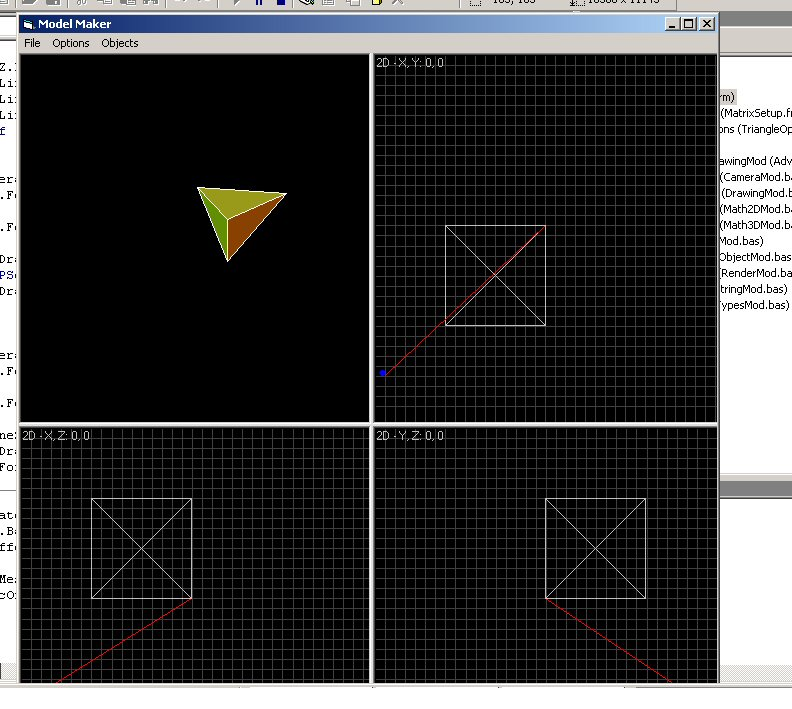



## Complete Pure 3D Engine with 3D Editor\! Must see for all mathematicians\.

### Description

This is a working complete 3D Engine(Model Editor), only using math and some API. I must admit some of the matrix code on psc really got me going to make this. If you are wondering what GB(Galatic Battle) is, then I can tell you that it was a game I was working on, only got the Engine finished though.

Please vote for me, inputs and any techniques for speeding up are agreatly appreciated.

One last thing, put focus on the render window and press "R" to switch bettwen render modes, and sorry but textures not completed yet.

- Julian
 
### More Info
 

             |
---                |---
**Submitted On**   |2004-11-03 14:29:18
**By**             |[Julian The Programmer](https://github.com/Planet-Source-Code/PSCIndex/blob/master/ByAuthor/julian-the-programmer.md)
**Level**          |Advanced
**User Rating**    |4.8 (53 globes from 11 users)
**Compatibility**  |VB 4\.0 \(32\-bit\), VB 5\.0, VB 6\.0
**Category**       |[Complete Applications](https://github.com/Planet-Source-Code/PSCIndex/blob/master/ByCategory/complete-applications__1-27.md)
**World**          |[Visual Basic](https://github.com/Planet-Source-Code/PSCIndex/blob/master/ByWorld/visual-basic.md)
**Archive File**   |[Complete\_P18201211192004\.zip](https://github.com/Planet-Source-Code/julian-the-programmer-complete-pure-3d-engine-with-3d-editor-must-see-for-all-mathematicia__1-57332/archive/master.zip)

